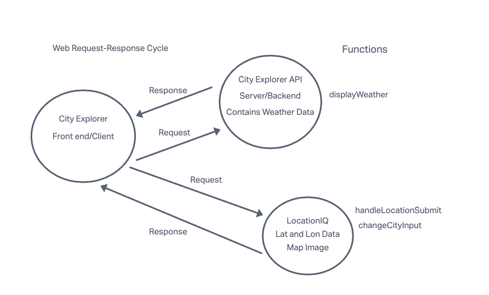
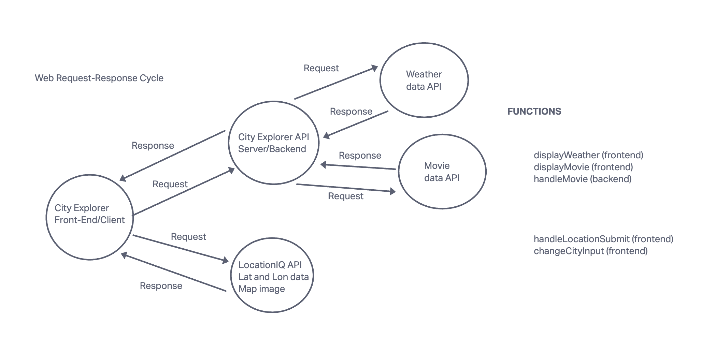

# City Explorer API

**Author**: Adnan Mohamud

**Version**: 1.0.2

## Overview

This application, City Explorer, is a web-based tool that allows users to explore weather forecast data and movies for different cities. The main problem domain addressed by this app is providing users with real-time weather information and movie details for locations of interest. By utilizing external APIs and displaying data in a user-friendly format, City Explorer simplifies the process of accessing weather and movie information.

## Getting Started

To build and run this app on your own machine, follow these steps:

1. Clone the city-explorer-api repository from GitHub.
2. Navigate to the project directory and run npm install to install the required dependencies.
3. Create a file named .env in the root directory and set the PORT variable to a desired port number (e.g., PORT=3001). Add .env to the .gitignore file to prevent accidental commits.
4. Copy the contents of the provided weather.json file into data/weather.json to serve as placeholder data for testing purposes.
5. Run the app using npm start or node server.js. The server will start running, and the app will be accessible on the specified port.

## Architecture

City Explorer is built using the MERN stack, which includes the following technologies:

* Express.js: As the backend framework to handle API requests and serve static files.
* React: For building the front-end user interface and rendering components.
* Node.js: As the server-side runtime environment for running JavaScript code.
* JavaScript: Used in the front-end to make asynchronous API requests to the backend server using Axios, a JavaScript library for handling HTTP requests
* Thunder Client: As a Visual Studio Code extension to send HTTP requests and test APIs directly from within the editor.

The front-end uses React components to handle user input and display weather and movie data. The backend utilizes Express to create API endpoints for retrieving weather and movie information based on user queries. The app makes API calls to external weather and movie services to fetch real-time data for display.

## Change Log

* 2023-07-01 3:30pm - Application set up with basic folder structure and initial dependencies installed.
* 2023-07-02 9:45am - Basic Express server created, with a GET route to retrieve weather data for specific locations.
* 2023-07-03 2:15pm - React components added for handling user input and displaying weather data.
* 2023-07-04 11:20am - API call to external weather service implemented to fetch real-time data.
* 2023-07-05 5:00pm - Error handling added to display user-friendly messages for API errors.
* 2023-07-08 9:00am - Implemented movie data retrieval and rendering based on location.

## Credit and Collaborations

City Explorer was built as part of an assignment for a web development class. The lab instructions and starter code were provided by the instructor. However, additional research and documentation from official libraries and APIs were used to implement specific features, such as error handling, API calls, and movie data retrieval. Also want to give a huge shoutout to the Ta's and also my classmate Luke Rodgers for helping me with this project.

## Time Estimates lab 07

Name of feature: Setting up my server repository, Weather, Errors

Estimate of time needed to complete: 1 week

Start time: Monday July 31st 3:00 p.m

Finish time: Monday August 7th 12:00 p.m

Actual time needed to complete: 1 week

## Time Estimates lab 08

Name of feature: Weather(live), Movies, Publish

Estimate of time needed to complete: 1 day

Start time: Wednesday August 9th 3:00 p.m

Finish time: Thursday August 10th 5:00 p.m

Actual time needed to complete: 1 day

## Web Request-Response Cycle

